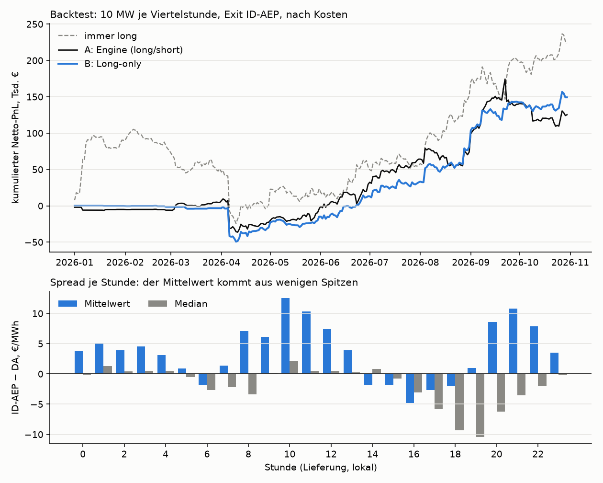

# de-power-strats

Handelsstrategien auf dem Spread-Modell von
[de-power-spread](https://github.com/ak16o7/de-power-spread) (im Folgenden: Engine).
Dieses Repo enthält **Strategie B, Long-only**: die Positionen des Engines unverändert,
jede Short-Position auf null. Backtest über den Walk-Forward des Engines, seit Oktober 2026
live mit öffentlichem, zeitgestempeltem Signal vor jeder Auktion.

Die Begründung ist eine Eigenschaft des Spreads, keine Verbesserung des Modells. Der ID-AEP
misst die letzten 500 MW vor Handelsschluss; dort entstehen Knappheitsspitzen fast nur nach
oben. Eine Short-Position verkauft diese Spitzen, ohne dafür eine Prämie zu bekommen, denn
die Prognose des Engines bildet die Spike-Flanke nicht ab.

## Hypothese

Der Spread ID-AEP − DA ist in der typischen Viertelstunde leicht negativ und im Mittel
positiv. Der Mittelwert stammt aus einem sehr kleinen Teil der Viertelstunden:

<!-- ANATOMY:START -->
Alle 38 596 Viertelstunden von 2025-10-01 bis 2026-11-07:

| ID-AEP − DA | €/MWh |
|---|---:|
| Mittelwert | +3,78 |
| **Median** | **-1,08** |
| Mittelwert ohne die äußersten 5 % je Seite | -0,01 |
| Mittelwert der Viertelstunden mit \|Spread\| ≤ 100 €/MWh | -0,98 |
| Anteil Viertelstunden mit ID-AEP > DA | 48 % |
| Anteil des obersten 1 % an der Summe aller Spreads | **122 %** |

Spikes über +200 €/MWh: 307 Viertelstunden an 100 Tagen; unter −200 €/MWh: 69. Sie häufen sich in den Rampenstunden (Grafik unten).

<!-- ANATOMY:END -->

- **Mechanik:** In den Rampenstunden (Morgen, Abend) trifft knappe flexible Leistung auf den
  dünnsten Teil des Intraday-Handels kurz vor Gate Closure. Der ID-AEP bildet genau diesen
  Teil ab. Abwärtsspitzen gibt es auch (Solarüberschuss mittags), aber deutlich seltener und
  kleiner.
- **Was das für Shorts heißt:** Das Engine schätzt den Erwartungswert auf einem
  winsorisierten Ziel (1 %/99 %). Eine Short-Position mit wenigen €/MWh prognostiziertem Edge
  trägt deshalb ein Aufwärtsrisiko, das in der Prognose nicht enthalten ist und mit fester
  Größe von 10 MW voll durchschlägt.
- **Was B ist:** dieselbe Prognose, ein anderes Risikoprofil. Rechtsschief, viele kleine
  Verlusttage, wenige große Gewinntage. B ist keine bessere Prognose und kein Beleg für einen
  Edge; die Zahlen unten zeigen, wo B gewinnt und wo nicht.

## Definition

| | |
|---|---|
| Entscheidung | 11:00 Uhr D-1, vor der Day-Ahead-Auktion (SDAC, Gate Closure 12:00) |
| Position je Viertelstunde | B = max(A, 0), mit A ∈ {−1, 0, +1} × 10 MW aus dem Engine |
| Einstieg / Ausstieg | Day-Ahead-Preis / ID-AEP (Benchmark, nicht handelbar) |
| Kosten | 0,25 €/MWh je Leg + 1,0 €/MWh Slippage = 1,5 €/MWh Round Trip |
| Modell, Features, Schwelle | unverändert aus dem Engine (Submodul `engine`, fester Commit): Gradient Boosting, Mittel aus 5 Fits, monatlicher Walk-Forward, Schwelle monatlich auf 28 Validierungstagen gewählt |

Die Schwelle wählt das Engine für A; B übernimmt sie, ohne sie für sich neu zu optimieren.
Auf den Ergebnissen von B ist nichts gefittet. Die PnL-Funktion, der Verfügbarkeitsfilter
und der Data Guard sind die des Engines.

## Ergebnis

<!-- RESULTS:START -->
Testzeitraum 2026-01-01 bis 2026-11-06 (310 Tage), Walk-Forward des Engines, 10 MW je Viertelstunde, Kosten 1,5 €/MWh Round Trip, Exit ID-AEP. Stand 2026-11-08.

| | **B: Long-only** | A: Engine | immer long |
|---|---:|---:|---:|
| Netto-PnL € | +167 138 | +166 849 | +243 809 |
| Volumen MWh | 25 140 | 38 720 | 74 400 |
| €/MWh | +6,65 | +4,31 | +3,28 |
| Sharpe p. a. (täglich) | 3,02 | 2,39 | 2,22 |
| t (HAC, täglich) | 2,75 | 2,26 | 1,74 |
| Max. Drawdown € | -23 563 | -67 590 | -129 624 |
| Schlechtester Tag € | -19 759 | -31 591 | -48 138 |
| Break-even-Slippage €/MWh | 7,7 | 5,3 | 4,3 |
| Spread gekappt ±200 €/MWh: PnL € (t) | +97 197 (2,70) | +159 428 (3,69) | +53 709 (0,57) |
| Spread gekappt ±100 €/MWh: PnL € (t) | +52 392 (1,64) | +123 921 (3,39) | -39 749 (-0,49) |
| ohne die 10 besten Tage € | +29 422 | +24 262 | +20 738 |
| die 10 besten Viertelstunden € | +56 610 | +56 610 | +77 833 |
| Sharpe 1. / 2. Hälfte | 0,43 / 4,60 | 1,23 / 3,17 | 0,22 / 4,14 |
| Monate im Plus | 6 von 11 | 7 von 11 | 8 von 11 |

- **Zerlegung:** A = B + A's Shorts. Die Shorts allein: -289 € auf 13 580 MWh (t -0,01).
- **B gegen A:** +1 €/Tag; bei gleichem Risiko t = 0,79; Sharpe-Differenz +0,63, Block-Bootstrap P(Sharpe B > A) = 0,72, 90-%-Intervall [-0,99; 2,14].
- **B gegen A, Spread gekappt ±200 €/MWh:** bei gleichem Risiko t = -1,55, P(Sharpe B > A) = 0,05.
- **B gegen immer long:** bei gleichem Risiko t = 0,78; P(Sharpe B > immer long) = 0,82, 90-%-Intervall [-0,66; 2,12].

**Lesart**

- Ungekappt hat B die höhere Sharpe (3,02 gegen 2,39), mit gekapptem Spread A (3,89 gegen 2,60). B gewinnt also über die Spike-Flanke, A über die normalen Viertelstunden. Welche Sicht gilt, hängt davon ab, ob die Spike-Preise des ID-AEP tatsächlich erzielbar sind.
- Konzentration: Ohne seine 10 besten Tage bleiben von B +29 422 € (18 % des Gewinns). Das Profil ist rechtsschief: viele kleine Verlusttage, wenige große Gewinntage.
- Die unbedingte Long-Prämie (immer long: Sharpe 2,22, gekappt ±200: +53 709 €) ist fast vollständig Spike-Prämie. B filtert sie mit den Prognosen des Engines: gekappt ±200 bleibt B bei +97 197 €.



**Robustheit von B**

| Variante | PnL € | Sharpe | t | t gekappt ±200 |
|---|---:|---:|---:|---:|
| feste Schwelle 2 €/MWh | +157 187 | 2,14 | 1,83 | 2,10 |
| feste Schwelle 5 €/MWh | +142 196 | 2,23 | 1,96 | 2,25 |
| feste Schwelle 10 €/MWh | +128 827 | 2,77 | 2,51 | 2,86 |
| B, Seeds 5–9 | +150 908 | 2,06 | 1,81 | 2,20 |
| A, Seeds 5–9 | +121 016 | 1,44 | 1,34 | 2,96 |

<sub>Engine 74ec0b4, Dataset-Revision 8b30c0b, Code ed7ce99. Alle Zahlen in [reports/REPORT.md](reports/REPORT.md) und `reports/backtest.json`.</sub>

<!-- RESULTS:END -->

Zerlegung: A = B + A's Shorts. „Immer long“ misst die unbedingte Long-Prämie des Spreads;
die gekappten Werte zeigen das Ergebnis ohne die Spike-Flanke.

## Einordnung und Grenzen

- **Kein Out-of-sample-Beleg.** Die Regel wurde nach der Analyse des Backtests von A
  festgelegt. Der Backtest von B zeigt, was die Regel auf diesen Daten getan hätte, beweist
  aber nichts. Belastbar ist erst der Live-Track-Record unten.
- **Abhängig von der Spike-Flanke.** Im Backtest bis Oktober 2026 war B ungekappt besser als
  A, mit gekapptem Spread nicht (Lesart oben). Ob die Spike-Preise des ID-AEP erzielbar sind, ist offen: Der Index ist nicht handelbar und
  misst die letzten 500 MW. Eine reale Ausführung über die letzten Handelsstunden (ID1/ID3)
  würde einen Teil davon nicht einfangen.
- **Konzentriert und regimeabhängig.** Ein großer Teil des PnL stammt aus wenigen Tagen. Die
  Long-Prämie war nicht in allen Monaten da; mehr Flexibilität im System (Batterien) kann
  Knappheitsspitzen dämpfen.
- **Nicht signifikant gegen A.** Im Backtest bis Oktober 2026 lag der gepaarte Vergleich gegen A
  unter t = 2.
- **Datenstand.** Die Wetterhistorie des Engines wird laufend um vollständige Modellläufe
  ergänzt, derzeit für November 2025 bis Mai 2026. Jede Ergänzung ändert die Features dieser
  Monate und damit die Backtest-Zahlen von A und B; jede Zahl trägt die Dataset-Revision
  (Fußzeile unter dem Ergebnis).
- Wie beim Engine: Signal, kein Handelssystem; kein Portfoliokontext, keine Intraday-Auktionen.

## Vorab festgelegte Live-Auswertung

Festgelegt vor dem ersten Live-Signal von B (Commit-Zeitpunkt dieses Abschnitts), danach
nicht geändert; die Werte stehen in [`strats/config.py`](strats/config.py).

- **Start:** das erste Signal nach diesem Commit. Gezählt wird jeder Liefertag, dessen Signal
  vor 11:50 Uhr fertig war; Tage ohne Signal werden aufgeführt, nicht nachgerechnet.
- **Auswertung nach 120 gezählten Tagen.** B ersetzt A nur, wenn B gegen A bei gleichem Risiko
  t > 1 erreicht, ungekappt **und** mit bei ±200 €/MWh gekapptem Spread, und der maximale
  Drawdown von B nicht schlechter ist als der von A. Sonst bleibt A.
- **Abbruch:** Fällt der kumulierte Live-PnL von B unter das 5-%-Quantil der Backtest-Summen
  über gleich viele Tage, wird B eingestellt.

## Live-Track-Record

- **Ablauf:** Täglich um 10:52 startet ein externer Scheduler die GitHub Action über die API
  (11:20 als Reserve, 18:35 für die Abrechnung). Sie rechnet das Signal des Engines neu, setzt
  die Shorts auf null und committet nach `signals/` (`side` = B, `side_engine` = A).
  Push-Zeitpunkt und Lauf-Protokoll belegen, dass das Signal vor Gate Closure existierte.
- **Abrechnung:** nach Veröffentlichung des ID-AEP mit der PnL-Funktion des Engines, zusammen
  mit A, A's Shorts, immer long und den gekappten Werten (`live/ledger.csv`).

<!-- LIVE:START -->
25 Tage abgerechnet (2026-10-19 bis 2026-11-12).

| | B: Long-only | A: Engine (Referenz) | A's Shorts | immer long |
|---|---:|---:|---:|---:|
| Netto € | **+12 096** (+5,18 €/MWh) | +295 | -11 801 | +53 872 |
| Spread gekappt ±200 €/MWh | +11 326 | +362 | | |
| Tage im Plus | 5 von 25 | 11 von 25 | | |

Abbruchgrenze nach 25 Tage (5-%-Quantil des Backtests über gleich lange Zeiträume): -9 859 €, nicht erreicht.
Vorab festgelegte Auswertung nach 120 gezählten Tagen: 25 von 120.

| Liefertag | Signal fertig (UTC) | Long-Viertelstunden | B € | A € | immer long € | B kumuliert € |
|---|---|---:|---:|---:|---:|---:|
| 2026-10-30 | 2026-10-29 09:55 | 33 | -226 | +662 | -2 658 | +8 117 |
| 2026-10-31 | 2026-10-30 09:55 | 72 | +3 980 | +3 266 | +5 061 | +12 096 |
| 2026-11-01 | 2026-10-31 09:55 | 0 | +0 | +136 | -1 126 | +12 096 |
| 2026-11-02 | 2026-11-01 09:55 | 0 | +0 | -2 730 | +12 914 | +12 096 |
| 2026-11-03 | 2026-11-02 09:55 | 0 | +0 | +0 | +12 973 | +12 096 |
| 2026-11-04 | 2026-11-03 09:55 | 0 | +0 | +991 | -5 990 | +12 096 |
| 2026-11-05 | 2026-11-04 09:55 | 0 | +0 | +830 | -8 289 | +12 096 |
| 2026-11-06 | 2026-11-05 09:55 | 0 | +0 | +0 | +4 712 | +12 096 |
| 2026-11-07 | 2026-11-06 09:55 | 0 | +0 | +329 | -2 423 | +12 096 |
| 2026-11-08 | 2026-11-07 09:55 | 0 | +0 | -234 | +134 | +12 096 |
| 2026-11-09 | 2026-11-08 09:55 | 0 | +0 | +318 | +10 609 | +12 096 |
| 2026-11-10 | 2026-11-09 09:55 | 0 | +0 | -635 | +3 804 | +12 096 |
| 2026-11-11 | 2026-11-10 09:55 | 0 | +0 | -2 260 | +7 464 | +12 096 |
| 2026-11-12 | 2026-11-11 09:55 | 0 | +0 | -62 | -2 707 | +12 096 |

Warten auf ID-AEP: 2026-11-13, 2026-11-14

<!-- LIVE:END -->

## Reproduktion

```bash
git clone --recursive https://github.com/ak16o7/de-power-strats
cd de-power-strats
python -m venv .venv && source .venv/bin/activate
pip install -r requirements-dev.txt

python -m pytest                       # synthetische Daten, kein Netz
python -m strats fetch --full          # Daten seit 2025-10-01 (ohne API-Keys über freie Quellen)
python -m strats backtest --robustness # Engine-Walk-Forward, B und Zerlegung -> reports/, README
```

- **Code:** `strats/rule.py` (die Regel, zwei Zeilen), `strats/analysis.py` (Backtest und
  Zerlegung), `strats/live.py` (Signal, Abrechnung, Auswertung), `strats/report.py`.
- **Engine:** Submodul `engine` auf festem Commit. Ein Update des Engines ändert die
  Prognosen und wird als eigener Commit mit neuem Backtest dokumentiert.
- **Betrieb:** Workflows in `.github/workflows`, von außen per `workflow_dispatch`-API
  gestartet: `Live` (Signal 10:52, Reserve 11:20, Abrechnung 18:35), `Backtest` (sonntags 08:00,
  Ergebnisblock im README), `CI`. Optionale Secrets wie beim Engine (`ENTSOE_API_KEY`,
  `NTP_CLIENT_ID`, `NTP_CLIENT_SECRET`).
